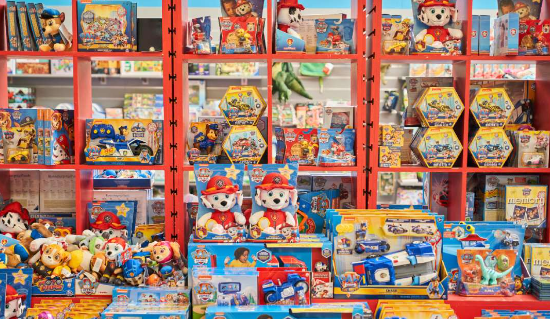

# Maven Toys
----

----
## Introduction
Sales and inventory data for a fictitious chain of toy stores in Mexico called **Maven Toys.** The data given includes information about products, stores, daily sales transactions, and current inventory levels at each location. This project is done using SQL to derive insights and crucial questions to help the Mexican store make data-driven decisions. 

**_Disclaimer: All datasets are not real and do not represent any company, institution, or country, but just to demonstrate the capabilities of SQL._**

## Problem statement 
1.	Which product category drives the biggest profit? Is it the same across all stores?
2.	How much money is tied up in inventory at the toy store? How long will it last?
3.	Are sales being lost without out-of-stock products at certain locations?

## Skills/concepts demonstrated:
The following SQL concepts were incorporated in the analysis:

1.	Sorting and filtering e.g. Where, Group by, having, order by, and limit.
2.	Aggregate functions e.g., sum, average, and count.
3.	Sub queries.
4.	Joins e.g., Inner join, left join, and right join.
5.	SQL views and case statements.

## Analysis:
1.	The product category that drives the biggest profit is **Toys** with a total profit of **£5,092,081.66.** with **Airport** location ranking as the **lowest** category and  **Downtown** as the **highest** category.
---
Total profit        |Category by ranking
:-----------------:|:-----------------:
|

2.	In order to get how much money is tied up in inventory, **the holding cost or working capital is calculated as the sum of each product cost multiplied by the stock on hand.** This amount is calculated across all 50 store locations with the figures as seen below. Also, to know how long the inventory tied up in these locations will last, I used the select statement with some aggregate functions like sum, average, count, and to_char to derive the answers below;
----
Holding Cost       | Lasting Period
:-----------------:|:---------------:
|
----
3. There are sales lost in each location but to know if sales are being lost with some of the products being out of stock, this depends on whether Maven Toys wants this information across all locations, certain locations, or the total sales that are lost. Each scenario is explained in the code.

## Conclusion and Recommendations:
1.	**Toys** drives the biggest profit, Maven Toys should invest in other products in order to derive more sales.  
2.	There are **37 different products** with zero stock on hand with a total loss of **£582.78.**
3.	There are some products tied up in inventory that can be sold at discounted prices.

## THANK YOU FOR READING! 😃👍

